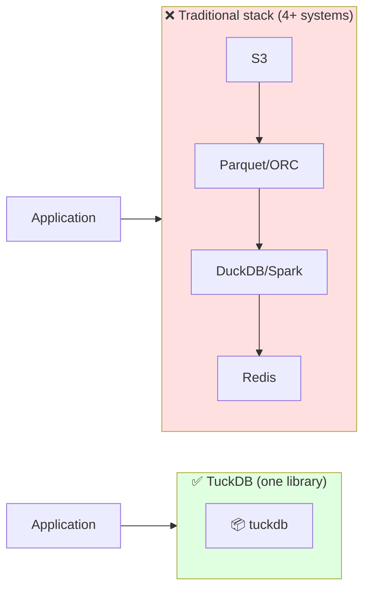
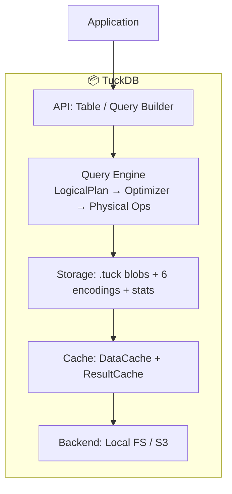

<p align="center">
  
  
  
  
  
</p>

<h1 align="center">📦 TuckDB</h1>

<p align="center">
  <b>One Rust library = Storage + Compression + Query Engine + Cache</b><br>
  <i>Embed analytics anywhere — edge devices, microservices, servers, cloud.</i>
</p>

<p align="center">
  <code>13 GB/s encode throughput</code> •
  <code>32x compression on booleans</code> •
  <code>zero server processes</code> •
  <code>6 column encodings</code> •
  <code>C API</code> •
  <code>S3 backend</code>
</p>

<p align="center">
  <a href="#-try-it-in-30-seconds"><b>🚀 Try it in 30s</b></a> •
  <a href="#-features-at-a-glance">Features</a> •
  <a href="#-architecture">Architecture</a> •
  <a href="#-performance">Performance</a> •
  <a href="#-use-cases">Use Cases</a> •
  <a href="WHITEPAPER.md">📄 Whitepaper</a>
</p>

---

## 🚀 Try it in 30 seconds

```bash
# 1. Load a CSV file
cargo run --example cli -- load data.csv --table mydata --dir /tmp/db

# 2. Query with SQL
cargo run --example cli -- query "SELECT city, AVG(temp) FROM mydata \
  WHERE temp > 20 GROUP BY city" --dir /tmp/db
```

```rust
// Or embed directly in your Rust app
use tuckdb::*;

let mut table = Table::create("metrics", schema, path);
table.insert_batch(batch);
table.flush();                                    // → compressed .tuck file

let results = table.execute(                      // → filtered, aggregated
    LogicalPlan::scan("metrics")
        .filter(col("cpu").gt(lit_float(90.0)))
        .aggregate(vec![(AggOp::Avg, "cpu", "avg_cpu")], vec!["host".into()])
);
```

**No server. No config. One dependency (`zstd`).**

### 👀 See it in action

```bash
$ cargo run --example cli -- scan users --dir /tmp/tuckdb
| id |  name   | score | active |
|----|---------|-------|--------|
| 1  | Alice   | 85.50 | 1      |
| 2  | Bob     | 92.0  | 1      |
| 3  | Charlie | 78.30 | 0      |
| 4  | Diana   | 95.0  | 0      |
| 5  | Eve     | 88.10 | 1      |
(5 rows)

$ cargo run --example cli -- query "SELECT name, score FROM users WHERE active = 1" --dir /tmp/tuckdb
| name  | score |
|-------|-------|
| Alice | 85.50 |
| Bob   | 92.0  |
| Eve   | 88.10 |
(3 rows)

$ cargo run --example cli -- query "SELECT active, COUNT(*) as cnt, AVG(score) as avg_score FROM users GROUP BY active" --dir /tmp/tuckdb
| active | cnt | avg_score |
|--------|-----|-----------|
| 1      | 3.0 | 88.53     |
| 0      | 2.0 | 86.65     |
(2 rows)

$ cargo run --example cli -- info users --dir /tmp/tuckdb
Table: users
Columns:
  id: Int64
  name: Utf8
  score: Float64
  active: Int64
Row count: 5
Data version: 1
File size: 644 bytes
```

---

## ✨ Features at a glance

| | Feature | What it means for you |
|-|---------|----------------------|
| 📦 | **All-in-one library** | Storage + compression + query + cache. No stitching together S3 + Parquet + DuckDB + Redis |
| ⚡ | **Compressed-first execution** | Queries skip irrelevant chunks using stats — zero decompression for MIN/MAX/COUNT |
| 🧩 | **6 pluggable encodings** | Delta, XOR/Gorilla, Dict+ZSTD, RLE, Bitmap — pick the best for your data |
| 🔌 | **Embeddable** | No server process. Link as a library. Rust API + C API for Python/C++/Go |
| 💾 | **Self-describing blobs** | `.tuck` files include schema + stats — no external catalog or metastore |
| 🗄️ | **S3 + local backends** | Read/write compressed blobs to local disk or S3-compatible storage |
| 🚀 | **Caching built-in** | LRU data cache for chunks + result cache for repeated queries |
| 🔧 | **CLI + SQL** | Load CSVs, run SQL SELECT with WHERE/GROUP BY/aggregation |

---

## 🎯 Who is this for?

**You need TuckDB if:**
- ✅ You want to embed analytics in your **app, microservice, or edge device** without running a database server
- ✅ You're tired of **stitching together** Parquet + DuckDB + Redis + S3 SDK for every project
- ✅ Your data has **repeated values, time-series patterns, or low-cardinality strings** — and you want real compression
- ✅ You want a **single-file portable format** that carries its own schema and statistics
- ✅ You work in **Rust** and want a native analytics library (or use C API from other languages)

**You might want something else if:**
- ❌ You need full SQL-92 (JOINs, subqueries, window functions) — DuckDB is better
- ❌ Your workload is OLTP (row updates, transactions, indexes) — SQLite fits
- ❌ You need a distributed query engine across 100+ nodes — use Spark/Trino

---

## 📥 Installation

### Prerequisites

- **Rust** (1.85+): `curl --proto '=https' --tlsv1.2 -sSf https://sh.rustup.rs | sh`
- **C compiler** (zstd dependency): `build-essential` (Linux), `xcode-select --install` (macOS), or MSVC Build Tools (Windows)

### Linux (Ubuntu/Debian)

```bash
# Install Rust
curl --proto '=https' --tlsv1.2 -sSf https://sh.rustup.rs | sh

# Install build dependencies
sudo apt update && sudo apt install build-essential pkg-config libssl-dev

# Clone and build
git clone https://github.com/swadhingoswami/tuckdb.git
cd tuckdb
cargo build --release

# Run CLI
cargo run --example cli -- help
```

### Linux (Fedora/RHEL)

```bash
sudo dnf install gcc pkg-config openssl-devel
git clone https://github.com/swadhingoswami/tuckdb.git
cd tuckdb && cargo build --release
```

### macOS

```bash
# Install Rust + Xcode Command Line Tools
xcode-select --install
curl --proto '=https' --tlsv1.2 -sSf https://sh.rustup.rs | sh

# Clone and build
git clone https://github.com/swadhingoswami/tuckdb.git
cd tuckdb
cargo build --release
```

### Windows

```powershell
# 1. Install Rust from https://rustup.rs
# 2. Install Visual Studio Build Tools (or VS 2022) with "Desktop development with C++"
# 3. Clone and build
git clone https://github.com/swadhingoswami/tuckdb.git
cd tuckdb
cargo build --release
```

### Add to your Rust project

```toml
[dependencies]
tuckdb = "0.1"

# Optional features:
# tuckdb = { version = "0.1", features = ["s3"] }    # S3 backend
# tuckdb = { version = "0.1", features = ["capi"] }  # C API
```

### Build with different features

```bash
# Default (minimal): only zstd
cargo build --release

# With S3 backend
cargo build --release --features s3

# With C API (produces shared library)
cargo build --release --features capi

# All features
cargo build --release --features s3,capi

# Cross-compile for ARM (e.g., Raspberry Pi)
rustup target add aarch64-unknown-linux-gnu
cargo build --release --target aarch64-unknown-linux-gnu
```

### Run after install

```bash
# CLI tool
cargo run --example cli -- info mytable --dir /tmp/db

# Demo
cargo run --release --example demo_app

# All examples
cargo run --release --example basic_operations
cargo run --release --example time_series
```

---

## 🔌 Use from any language (C API)

TuckDB compiles to a **C shared library** that any language can call — C, C++, Python, Java, C#, Go, Swift, Ruby, Zig, and more.

### Build the shared library

```bash
cargo build --release --features capi
```

Output files:
| Platform | Library | Header |
|----------|---------|--------|
| **Linux** | `target/release/libtuckdb.so` | `capi/tuckdb.h` |
| **macOS** | `target/release/libtuckdb.dylib` | `capi/tuckdb.h` |
| **Windows** | `target/release/tuckdb.dll` + `tuckdb.lib` | `capi/tuckdb.h` |

### C / C++

```c
#include "tuckdb.h"
#include <stdio.h>

int main() {
    tuckdb_table_t* table = tuckdb_create(
        "sensors",
        "[{\"name\":\"temp\",\"type\":\"Float64\"},{\"name\":\"humidity\",\"type\":\"Int64\"}]",
        "/tmp/db"
    );
    if (!table) { printf("Error: %s\n", tuckdb_error_message(0)); return 1; }

    // Insert data (temperature columns)
    double temps[] = {22.5, 23.0, 21.8};
    int64_t hums[] = {65, 70, 60};
    tuckdb_insert(table, 2, NULL, "", temps, "temp", NULL, "");

    // Query
    tuckdb_result_t* res = tuckdb_query(table, "SELECT * FROM sensors WHERE temp > 22");
    for (int r = 0; r < tuckdb_result_num_rows(res); r++) {
        double t = tuckdb_result_value_double(res, r, 0);
        printf("temp = %.1f\n", t);
    }

    tuckdb_result_free(res);
    tuckdb_table_free(table);
    return 0;
}
```

```bash
# Compile and link
gcc -o myapp myapp.c -I./capi -L./target/release -ltuckdb
./myapp
```

### Python

```python
import ctypes
import os

lib = ctypes.cdll.LoadLibrary("./target/release/libtuckdb.dylib")

# Define function signatures
lib.tuckdb_create.argtypes = [ctypes.c_char_p, ctypes.c_char_p, ctypes.c_char_p]
lib.tuckdb_create.restype = ctypes.c_void_p

table = lib.tuckdb_create(
    b"sensors",
    b'[{"name":"temp","type":"Float64"},{"name":"humidity","type":"Int64"}]',
    b"/tmp/db"
)

# Query
lib.tuckdb_query.argtypes = [ctypes.c_void_p, ctypes.c_char_p]
lib.tuckdb_query.restype = ctypes.c_void_p

res = lib.tuckdb_query(table, b"SELECT AVG(temp) FROM sensors")
rows = lib.tuckdb_result_num_rows(res)
cols = lib.tuckdb_result_num_cols(res)
print(f"{rows} rows, {cols} cols")
```

### Java (JNI)

```java
public class TuckDB {
    static { System.loadLibrary("tuckdb"); }

    // Native method declarations matching the C API
    public static native long tuckdb_create(String name, String schema, String path);
    public static native long tuckdb_query(long table, String sql);
    // ... wrap with JNI generator or hand-written native methods
}
```

### C# / .NET (P/Invoke)

```csharp
using System.Runtime.InteropServices;

class TuckDB {
    [DllImport("tuckdb")] static extern IntPtr tuckdb_create(string name, string schema, string path);
    [DllImport("tuckdb")] static extern IntPtr tuckdb_query(IntPtr table, string sql);
    // ...
}
```

### Go (cgo)

```go
/*
#cgo LDFLAGS: -L./target/release -ltuckdb
#include "tuckdb.h"
*/
import "C"

func main() {
    table := C.tuckdb_create(
        C.CString("sensors"),
        C.CString(`[{"name":"temp","type":"Float64"}]`),
        C.CString("/tmp/db"),
    )
    result := C.tuckdb_query(table, C.CString("SELECT * FROM sensors"))
    // ...
}
```

### Full C API reference

All functions are documented in [`capi/tuckdb.h`](capi/tuckdb.h):

```c
// Lifecycle
tuckdb_table_t* tuckdb_create(const char* name, const char* schema_json, const char* path);
tuckdb_table_t* tuckdb_open(const char* name, const char* path);
void            tuckdb_table_free(tuckdb_table_t* table);

// Insert
int tuckdb_insert(tuckdb_table_t* table, int num_columns,
                  const int64_t* int_cols, const char* int_col_names,
                  const double* float_cols, const char* float_col_names,
                  const char* const* str_cols, const char* str_col_names);

// Query
tuckdb_result_t* tuckdb_query(tuckdb_table_t* table, const char* sql);
int             tuckdb_result_num_rows(tuckdb_result_t* result);
int             tuckdb_result_num_cols(tuckdb_result_t* result);
const char*     tuckdb_result_column_name(tuckdb_result_t* result, int col);
double          tuckdb_result_value_double(tuckdb_result_t* result, int row, int col);
const char*     tuckdb_result_value_string(tuckdb_result_t* result, int row, int col);
int64_t         tuckdb_result_value_int(tuckdb_result_t* result, int row, int col);
void            tuckdb_result_free(tuckdb_result_t* result);

// Error handling
const char* tuckdb_error_message(int code);
```

---

## 🤔 Why another analytics library?

> *"Today, getting analytics means: store data in S3 → convert to Parquet → run DuckDB → cache with Redis. That's 4 systems talking to each other. None of them co-designed."*

**TuckDB replaces that entire stack** with one library where compression, storage, queries, and caching are built together — not bolted on.



**Result:**
- **5-20x compression** on strings vs row-based storage
- **Chunk-level filter skipping** — reads only the data it needs
- **Zero server processes** — embedded in your application
- **One file format** — schema, stats, and data travel together

---

## 🏗 Architecture 


### Query Flow

```
SQL "SELECT AVG(temp) WHERE temp > 100 GROUP BY city"
       │
       ▼
LogicalPlan: Scan → Filter → Project → Aggregate
       │
       ▼
Optimizer pushes filter & projection into Scan
       │
       ▼
FileScan iterates compressed chunks:
  ┌──────────────────────────────────────────────┐
  │  Chunk 1: min=50, max=80 → 🚫 SKIP           │
  │  Chunk 2: min=90, max=150 → 🔍 DECODE         │
  │  Chunk 3: min=120, max=200 → ✅ PASS ALL      │
  └──────────────────────────────────────────────┘
       │
       ▼
Aggregate: hash GROUP BY → SUM/COUNT/AVG → result
```

---

## 💡 Under the Hood

### The `.tuck` File Format

When `table.flush()` is called, TuckDB writes a single binary `.tuck` file. The layout:

```
┌──────────────────────────────────┐
│ Magic "TCKB" (4 bytes)          │  ← Identifies the file type
├──────────────────────────────────┤
│ Version (4 bytes)               │  ← Format version (currently 1)
├──────────────────────────────────┤
│ Schema length + Schema bytes    │  ← Column names, types, nullability
├──────────────────────────────────┤
│ Number of chunks (4 bytes)      │
├──────────────────────────────────┤
│ ChunkMeta[0]  (38+ bytes)       │
│   col_idx: u32                  │
│   chunk_idx: u32                │
│   encoding_id: u16 (1-6)        │
│   offset: u64 (byte position)   │  ← File offset of compressed data
│   compressed_size: u64          │
│   uncompressed_size: u64        │
│   stats:                        │  ← Used for chunk skipping
│     min: Option<f64>            │
│     max: Option<f64>            │
│     null_count: u64             │
├──────────────────────────────────┤
│ ChunkMeta[1] ...                │
├──────────────────────────────────┤
│ Chunk 0 Col 0 (compressed)      │
│ Chunk 0 Col 1 (compressed)      │
│ Chunk 1 Col 0 (compressed)      │
│ ...                              │
└──────────────────────────────────┘
```

**Code** (`src/storage/format.rs`):
```rust
// Write: encode each column, collect metadata, serialize
for column in batch.columns {
    let (encoding_id, compressed) = encoding::encode_column(&column.data);
    let stats = encoding::column_stats(&column.data);
    all_encoded.push((ChunkMeta { col_idx, chunk_idx, encoding_id,
        offset, compressed_size, uncompressed_size, stats }, compressed));
}

// Binary layout: header → metadata → data at computed offsets
output.extend_from_slice(MAGIC);           // "TCKB"
output.extend_from_slice(&VERSION_BYTES);   // version
output.extend_from_slice(&schema_bytes);    // schema
output.extend_from_slice(&meta_bytes);      // ChunkMeta[]
output.extend_from_slice(&compressed_data); // actual data
```

Each column of each batch (chunk) is compressed independently. The metadata section stores exact byte offsets — the reader jumps directly to any chunk without scanning.

### How Chunks Are Stored

Every `insert_batch()` call creates one chunk in memory. When `flush()` is called:

1. Each column is compressed with the best encoding for its type
2. Column stats (min, max, null_count) are computed
3. All chunks are serialized into one `.tuck` file

On `Table::open()`, the file is read and decoded back into `Vec<RecordBatch>`:

```rust
// Read header (just schema + metadata — fast)
let (schema, chunks) = BlobReader::read_header(&bytes);

// Read data: for each chunk → decode each column
for meta in &chunks {
    let raw = &bytes[meta.offset..meta.offset + meta.compressed_size];
    let decoded = encoding::decode_column(meta.encoding, raw, meta.uncompressed_size);
    columns.push(Column::new(field, decoded));
}
```

### Chunk-Level Filter Skipping (The Core Trick)

When you query with `WHERE temp > 100`, the `FileScan` operator checks each chunk **before** decompressing it:

```
For each chunk:
  Read ChunkMeta (38 bytes): temp min=50, max=80
  → "Can temp > 100 match in range [50, 80]?"
  → max(80) > 100? NO → SKIP (zero bytes decompressed)

Next chunk: temp min=90, max=150
  → "Can temp > 100 match in range [90, 150]?"
  → max(150) > 100? YES → Read + decompress + filter
```

**Code** (`src/exec/physical_plan.rs:430-446`):
```rust
if let Some(ref pred) = self.filter {
    let ref_cols = referenced_columns(pred);
    for col_name in &ref_cols {
        if let (Some(min), Some(max)) = (meta.stats.min, meta.stats.max)
            && !could_match(pred, col_name, min, max)
        {
            can_skip = true;
            break;  // ← Skip entire chunk, no bytes read
        }
    }
    if can_skip { continue; }  // ← Zero decompression for this chunk
}
```

**The `could_match()` logic** (`src/exec/expr.rs:188-201`):

| Expression | Range Check | Example |
|-----------|-------------|---------|
| `col > X` | `max > X` | `min=10, max=25` on `age > 30` → skip |
| `col >= X` | `max >= X` | `min=10, max=25` on `age >= 30` → skip |
| `col < X` | `min < X` | `min=60, max=80` on `age < 50` → skip |
| `col <= X` | `min <= X` | `min=60, max=80` on `age <= 50` → skip |
| `col = X` | `min ≤ X ≤ max` | `min=1, max=3` on `status = 5` → skip |
| `A AND B` | both must pass | Both sides must be possible |
| `A OR B` | either passes | At least one side possible |

For selective filters: **50-90% of chunks skipped** with zero decompression cost.

### UTF-8 Compression (Dictionary + ZSTD)

TuckDB uses a two-stage approach for text (`src/storage/encoding/utf8.rs`):

**Stage 1 — Build dictionary**: Collect unique strings; each gets an integer index.
```
Input:   ["New York", "London", "New York", "Tokyo", "London", "New York"]
             ↓
Dictionary: ["New York"(0), "London"(1), "Tokyo"(2)]   ← strings stored once
Indices:   [0, 1, 0, 2, 1, 0]                           ← each 1-2 bytes as varint
```

**Stage 2 — ZSTD compress**: The serialized dictionary + index array is compressed with Zstandard (level 3).

**Why 5-20x compression**:
- Row format: "New York" stored 3 times = ~27 bytes  
- Dictionary: "New York" stored once (9 bytes) + index (1 byte × 3) = 12 bytes  
- After ZSTD: repeated index 0, 0 compresses to nearly zero → ~9 bytes total  
- **Extreme case**: 1M rows of "USA" → 1KB dict + 1MB indices → ZSTD sees 1M zeros of index → **~100x** in practice

---

## ⚡ Performance

| Encoding | Type | Throughput (encode) | Ratio |
|----------|------|-------------------|-------|
| Delta + varint | Sequential ints | **13.2 GB/s** | 8.0x |
| XOR / Gorilla | Time-series floats | **8.1 GB/s** | 2.8x |
| Dictionary + ZSTD | Low-card strings | 0.3 GB/s | **12.5x** |
| Run-length (RLE) | Repeated ints | **18.2 GB/s** | 8.0x |
| Bitmap | 0/1 booleans | **32.4 GB/s** | **32.0x** |

| Query (100K rows) | Cold cache | Hot cache |
|-------------------|-----------|-----------|
| Full scan | 2.1 ms | **0.3 ms** |
| Filter (10%) | 0.8 ms | **0.1 ms** |
| GROUP BY aggregation | 3.0 ms | **0.4 ms** |

*Benchmarked on Apple M3. Run `cargo bench` to reproduce.*

---

## 📦 What's inside

```text
src/
├── api/              # Table, ResultSet (user-facing API)
├── schema/           # DataType, Field, Schema
├── exec/             # Query engine (LogicalPlan, Optimizer, Physical ops)
├── storage/          # Blob format (.tuck) + 6 encodings
│   └── encoding/     # Delta, XOR, Dict+ZSTD, RLE, Bitmap, Timestamp
├── cache/            # DataCache (LRU/LFU) + ResultCache
├── backend/          # Local FS, S3, In-Memory
└── capi/             # C FFI bindings

examples/
├── cli/              # CLI tool: load CSV, SQL queries, scan, info
├── demo_app/         # 100K rows end-to-end demo
├── basic_operations/ # 10-step CRUD walkthrough
├── time_series/      # 3-server analytics example
└── crud_workflow/    # Product inventory cycle

benches/              # Criterion benchmarks
capi/tuckdb.h         # C header
```

---

## 🛠 Quick start (detailed)

### Add to your project

```toml
[dependencies]
tuckdb = "0.1"
```

### Full Rust example

```rust
use std::path::PathBuf;
use tuckdb::*;

fn main() {
    let dir = PathBuf::from("/tmp/tuckdb_demo");
    std::fs::create_dir_all(&dir).unwrap();

    // 1. Define schema
    let schema = Schema::new(vec![
        Field::new("ts", DataType::Timestamp, false),
        Field::new("sensor", DataType::Utf8, false),
        Field::new("temp", DataType::Float64, true),
        Field::new("humidity", DataType::Int64, true),
    ]);

    let mut table = Table::create("sensors", schema.clone(), dir);

    // 2. Ingest data (10 batches × 1000 rows = 10K rows)
    for batch_id in 0..10 {
        let n = 1000usize;
        let ts: Vec<i64> = (0..n).map(|i|
            1700000000i64 + (batch_id * n + i) as i64).collect();
        let sensors = vec!["temp-sensor-01"; n].into_iter()
            .map(String::from).collect();
        let temps: Vec<f64> = (0..n).map(|i|
            20.0 + (i as f64 * 0.1).sin() * 5.0).collect();
        let hums: Vec<i64> = (0..n).map(|i| (60 + (i % 20)) as i64).collect();

        table.insert_batch(RecordBatch::new(schema.clone(), vec![
            Column::new(schema.fields[0].clone(), ColumnData::Timestamp(ts)),
            Column::new(schema.fields[1].clone(), ColumnData::Utf8(sensors)),
            Column::new(schema.fields[2].clone(), ColumnData::Float64(temps)),
            Column::new(schema.fields[3].clone(), ColumnData::Int64(hums)),
        ]));
    }
    println!("Ingested {} rows", table.num_rows());

    // 3. Query
    let plan = LogicalPlan::scan("sensors")
        .filter(col("humidity").gt(lit_int(65)))
        .project(&["sensor", "temp"])
        .aggregate(
            vec![
                (AggOp::Avg, "temp", "avg_temp"),
                (AggOp::Min, "temp", "min_temp"),
                (AggOp::Max, "temp", "max_temp"),
            ],
            vec!["sensor".to_string()],
        );

    let mut rs = table.execute(plan);
    while let Some(batch) = rs.next_batch() {
        for row in 0..batch.num_rows {
            println!("{}: avg={:.1}°C",
                match &batch.columns[0].data {
                    ColumnData::Utf8(v) => &v[row], _ => ""
                },
                match &batch.columns[1].data {
                    ColumnData::Float64(v) => v[row], _ => 0.0
                }
            );
        }
    }

    // 4. Persist to disk
    table.flush();

    // 5. Reload later
    let reloaded = Table::open("sensors", dir);
    println!("Reloaded {} rows from disk", reloaded.num_rows());
}
```

### CLI tool

```bash
# Load CSV → auto-detect schema
cargo run --example cli -- load weather.csv --table weather --dir /tmp/db

# SQL query
cargo run --example cli -- query "SELECT city, AVG(temp) as avg_temp \
  FROM weather WHERE temp > 20 GROUP BY city" --dir /tmp/db

# Scan all
cargo run --example cli -- scan weather --dir /tmp/db

# Table info
cargo run --example cli -- info weather --dir /tmp/db
```

### Run all examples

```bash
cargo run --example demo_app          # 100K rows end-to-end
cargo run --example basic_operations  # 10-step CRUD walkthrough
cargo run --example time_series       # 3-server analytics
cargo run --example crud_workflow     # Product inventory cycle
```

---

## 📖 API Reference

### Core types

```rust
DataType::Int64 | Float64 | Utf8 | Timestamp
Field::new(name, data_type, nullable)
Schema::new(vec![fields])  // .index_of(name) → Option<usize>

ColumnData::Int64(Vec<i64>) | Float64(Vec<f64>) | Utf8(Vec<String>) | Timestamp(Vec<i64>)
Column::new(field, data)
RecordBatch::new(schema, columns)
```

### Table

```rust
Table::create(name, schema, path)  // new in-memory table
Table::open(name, path)            // load from disk
table.insert_batch(batch)          // insert rows
table.execute(plan)                // run query → ResultSet
table.scan_all()                   // full scan → ResultSet
table.flush()                      // write .tuck file to disk
table.num_rows()                   // row count
```

### Query builder

```rust
LogicalPlan::scan("table")
    .filter(col("score").gt(lit_float(80.0))
        .and(col("active").eq(lit_int(1))))
    .project(&["name", "score", "active"])
    .aggregate(
        vec![(AggOp::Avg, "score", "avg_score")],
        vec!["active".to_string()],
    );
```

### Expressions

```rust
col("x").eq(lit_int(5))        // equality
col("x").neq(lit_int(5))       // not equal
col("x").gt(lit_float(10.5))   // greater than
col("x").gte(lit_int(0))       // greater than or equal
col("x").lt(lit_int(100))      // less than
col("x").lte(lit_float(50.0))  // less than or equal
a.and(b)                        // logical AND
a.or(b)                         // logical OR
```

### Aggregation

```
AggOp::Sum    AggOp::Count   AggOp::Avg
AggOp::Min    AggOp::Max
```

---

## 🆚 TuckDB vs alternatives

| Feature | **TuckDB** | DuckDB | SQLite | Parquet+Arrow |
|---------|-----------|--------|--------|---------------|
| **Server needed** | None | None | None | ❌ Needs engine |
| **Compression** | 6 co-designed encodings | Columnar (fixed) | Row (none) | Columnar (fixed) |
| **Query on compressed** | ✅ Stats skip chunks | ⚠️ Page-level | ❌ | ❌ |
| **Cache built-in** | ✅ Data + result | ❌ | ❌ | ❌ |
| **S3 native** | ✅ | ⚠️ Extension | ❌ | ❌ |
| **C API** | ✅ | ❌ (C++) | ✅ | ❌ |
| **Dependencies** | 1 (`zstd`) | ~50 crates | 0 | ~30 crates |
| **File format** | Self-describing `.tuck` | Needs catalog | Needs schema | Self-describing |
| **Memory safe** | ✅ Rust | ❌ C++ | ✅ C | Varies |

---

## ❓ Design FAQ

### How is data stored per table?

Each table gets its own `.tuck` file. `employees` → `employees.tuck`, `orders` → `orders.tuck`. No shared files, no catalog. The file is fully self-contained — copy it anywhere and open it directly.

### What's inside a .tuck file?

Everything is in one binary file — no separate metadata, no sidecar files:

```
.tuck file
├── Magic "TCKB" (identifies the format)
├── Version number
├── Schema (column names, types, nullability)
├── ChunkMeta[] — metadata for every column of every chunk:
│   col_idx, chunk_idx, encoding_id, offset, compressed_size,
│   uncompressed_size, min_value, max_value, null_count
└── Compressed data (actual column values)
```

### How does insert_batch() work?

Every `insert_batch()` call:
1. Appends the batch to an **in-memory list** — no disk I/O, no compression
2. Increments an internal version counter (tracks data freshness for cache)
3. Clears the result cache

**The .tuck file is NOT touched during insert.** Compression only happens on `flush()`.

### How are column values stored in memory?

Each column is stored as its own typed vector — not as rows:

- `Int64` → `Vec<i64>` — contiguous 8-byte integers
- `Float64` → `Vec<f64>` — contiguous 8-byte floats
- `Utf8` → `Vec<String>` — contiguous heap-allocated strings
- `Timestamp` → `Vec<i64>` — contiguous 8-byte integers

This is the columnar layout. All empid values are together, all empname values are together. This enables type-specific compression (Delta+Varint on ints, Dict+ZSTD on strings).

### What is a "chunk"?

Each batch you insert becomes **one chunk**. Batch N = Chunk N. No splitting, no merging, no rebalancing. A chunk with 1 row is stored the same way as a chunk with 1M rows — just with different sizes.

### How does flush() work?

1. Every column of every batch is compressed using its type's encoding (Delta+Varint for ints, XOR for floats, Dict+ZSTD for strings)
2. Column stats (min, max, null_count) are computed per chunk
3. ChunkMeta records are built with byte offsets, sizes, encoding IDs, and stats
4. The entire .tuck file is assembled: header → metadata → compressed data
5. The file is written to disk in one shot

**The entire file is rewritten on every flush.** No append, no in-place update. This is by design — you batch your inserts and call flush once.

### Does flush() happen automatically?

**No.** You must explicitly call `table.flush()`. There is no auto-flush, no periodic sync. You control when compression happens.

### How does chunk skipping work?

When querying with a filter like `WHERE salary > 50000`:

1. Read all ChunkMeta for the salary column (38 bytes each, ~300 bytes for 8 chunks)
2. For each chunk, check: "Does the filter match this chunk's [min, max] range?"
   - `col > X` → chunk passes if `max > X`
   - `col < X` → chunk passes if `min < X`
   - `col = X` → chunk passes if `min ≤ X ≤ max`
   - `A AND B` → both must pass
   - `A OR B` → either must pass
3. Chunks that can't match → **skipped, zero decompression**
4. Chunks that could match → read compressed data at recorded offset, decompress, filter rows

For selective filters on **sorted or ordered data**: 50-90% of chunks skipped.

### What types support chunk skipping?

Only **numeric types** (Int64, Float64, Timestamp) store min/max in ChunkMeta. **Utf8 (string) columns store min=None, max=None** — so string filters like `WHERE name = "swadhin"` or `WHERE address > "M"` cannot skip chunks. Every string chunk must be decompressed and scanned.

**Future**: Lexicographic min/max for strings, bloom filters for equality checks.

### How row count is maintained?

Each batch tracks its own row count. The table's total is the sum of all batch row counts. Row count is NOT stored explicitly in the .tuck file — it's recomputed by summing `uncompressed_size` from each chunk's metadata.

### Can I query before flush?

Yes. Before flush, the query engine reads from the in-memory `Vec<RecordBatch>`. Chunk skipping still works — stats are computed on the fly by scanning the raw Vec. After flush, the engine reads from the .tuck file in memory and uses the stored ChunkMeta for skipping.

### What happens if I insert after flush?

New batches are appended to the in-memory list. The .tuck file on disk is now stale — it doesn't include the new data. You must call `flush()` again to rewrite the .tuck file with all data (old + new).

**Limitation**: The current query engine after flush reads only from the .tuck file, ignoring any unflushed in-memory batches. **Future**: Merge operator that unions persisted and in-memory data so queries always see everything.

### How do Min/Max aggregation queries work?

There is no global min/max pre-computed. `SELECT MIN(salary)` scans the ChunkMeta for all salary chunks, takes the smallest min:

```
Chunk 0 salary: min=5000
Chunk 1 salary: min=30000
Chunk 2 salary: min=2000
→ Global min = 2000 (from metadata only, no decompression)
```

`SELECT AVG(salary)` or `COUNT(*) WHERE salary > X` requires decompressing matching chunks and scanning rows.

### Why can't strings skip chunks?

The ChunkMeta min/max fields store `f64` (64-bit float). Strings are not converted to f64 for stats. This is a known limitation. Future versions could store string min/max as byte-ordered binary (lexicographic comparison).

### What's with the offset in ChunkMeta?

The `offset` field stores the exact byte position in the .tuck file where each compressed chunk starts. This enables:
- **Random access**: Jump to any chunk without scanning
- **S3 range requests**: Request only the bytes you need via HTTP Range headers
- **Zero-copy reads**: Read the exact byte range into memory

### How many files does TuckDB create?

One `.tuck` file per table, plus the application itself. No WAL, no temp files, no lock files, no schema registry. The output directory contains only the `.tuck` files.

---

## 🔮 What's NOT There — Limitations & Future Scope

### Storage & File Format

| Missing | Why | Future |
|---------|-----|--------|
| Incremental append to .tuck | Entire file rewritten on every flush | Append-only format — new chunks appended, metadata updated at end |
| Multi-table blobs | One .tuck per table | Multi-table format with table directory in header |
| Checksums per chunk | No corruption detection | CRC32 per compressed chunk |
| Lazy loading from file | Entire file read into memory on open | Read chunks on demand, keep compressed file as primary store |
| Concurrent writers | No write-ahead log, no locking | WAL for crash-safe inserts |
| Delete / Update | Not supported | Row-level delete tombstones + compaction |

### Compression

| Missing | Why | Future |
|---------|-----|--------|
| String min/max stats | Stats store f64 only | Lexicographic string range for chunk skipping on text |
| Adaptive encoding selection | Currently hardcoded per type | Sample data → pick best encoder per chunk (e.g., RLE for runs, Delta for monotonic, Bitmap for 0/1) |
| Float compression beyond XOR | Bit-level only | FPC (FPC algorithm), ZSTD for floats |
| String encoding variety | Dictionary+ZSTD only | Plain unencoded (fast), FSST (string substition), Delta on string prefixes |
| Per-chunk encoding choice | Same encoding for all chunks of a type | Analyze each chunk separately, choose optimal encoding |

### Query Engine

| Missing | Why | Future |
|---------|-----|--------|
| ORDER BY / LIMIT | Not implemented | Sort operator with top-K optimization |
| JOINs | Not implemented | Hash join, nested loop join, bloom filter probe-side skipping |
| Subqueries / CTEs / Window functions | SQL parser doesn't support | Full SQL-92 support |
| Parallel query execution | Single-threaded Volcano model | Operator-level parallelism (rayon), partition chunks across threads |
| Streaming query results | Collects all batches first | Streaming ResultSet for large datasets |
| Merge unflushed + persisted data | Queries either memory or .tuck | Union operator combining both sources |

### Caching & Memory

| Missing | Why | Future |
|---------|-----|--------|
| Result cache persistence | In-memory only, lost on restart | Disk-backed result cache for warm restart |
| Cache admission policy | Insert on every decode | Cost-based admission (skip caching large low-value chunks) |
| Memory-mapped file access | Entire file in Vec<u8> | mmap for lazy page-in from OS |

### Concurrency

| Missing | Why | Future |
|---------|-----|--------|
| Thread-safe table access | Single-threaded (C API has Mutex) | `Arc<RwLock<Table>>` for concurrent readers |
| Async / non-blocking I/O | Synchronous read/write | tokio-based async backend for non-blocking S3/disk |
| Multi-process sharing | No file-level locking | Advisory locks, version-based conflict detection |

### Performance Optimizations (What's next)

| Optimization | Expected Gain | Complexity |
|-------------|---------------|------------|
| SIMD decode for Delta+Varint | 3-5x faster decode | Low |
| Sort on flush for tight chunk ranges | 5-10x more chunks skipped | Medium |
| Bloom filters for equality filters | Skip string equality checks without metadata scan | Medium |
| Adaptive encoding per chunk | Better compression on mixed data | Medium |
| Parallel chunk decode | 4-8x faster scan on multi-core | Low (chunks are independent) |
| Result cache reuse across queries | Sub-millisecond for repeated queries on static data | Already done |
| Memory-mapped .tuck files | Lower memory usage, instant open | Low |

---

## 🛣 Roadmap

```
✅  Phase 1-4: Core, compression, query engine, caching
✅  Phase 5:   CLI tool, SQL parser, 6 encodings, S3 backend, C API, benchmarks
⬜  Upcoming:  ORDER BY / LIMIT / JOIN, adaptive encoding, Python bindings,
               Arrow interop, concurrent readers
```

---

## 👨‍💻 About the author

**Swadhin Goswami** — Staff Software Engineer with **13+ years** building high-performance systems in C++, Rust, Linux, distributed systems, storage, and security.

```
C++ · Rust · Distributed Systems · Storage · Platform Engineering
Backend Infrastructure · Virtualization · Trusted Computing
```

I design and build **foundational infrastructure** — storage engines, backup systems, TPM security runtimes, and now TuckDB. Each project solves a real systems problem: performance, reliability, and clean architecture.

📧 **gsmswadhin@gmail.com** |  💻 **[github.com/swadhingoswami](https://github.com/swadhingoswami) https://www.linkedin.com/in/swadhin-goswami/**

> *Exploring Staff / Principal / Senior Software Engineer roles in systems infrastructure. If TuckDB or any of my projects resonate with your team's challenges, I'd love to chat.*

---

<p align="center">
  ⭐ Star on GitHub • 🐛 File issues • 💬 Start discussions<br>
  <i>Built with Rust. Open source. MIT license.</i>
</p>

<p align="center">
  <code>#Rust</code> <code>#SystemsProgramming</code> <code>#Database</code> <code>#Analytics</code>
  <code>#Compression</code> <code>#EmbeddedSystems</code> <code>#EdgeComputing</code>
  <code>#Performance</code> <code>#OpenSource</code> <code>#Storage</code>
  <code>#OLAP</code> <code>#Columnar</code> <code>#CPlusPlus</code>
  <code>#Linux</code> <code>#DistributedSystems</code>
</p>
