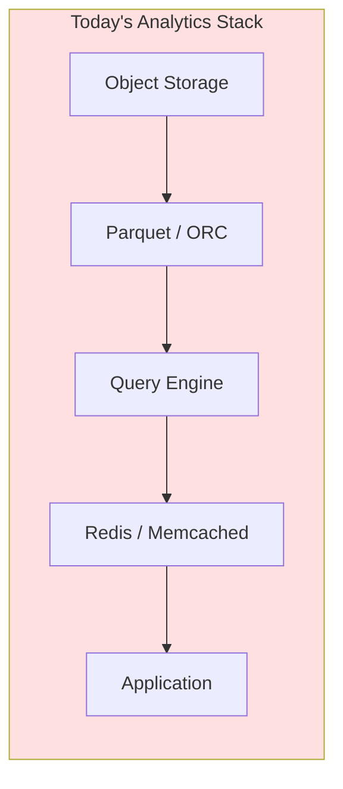
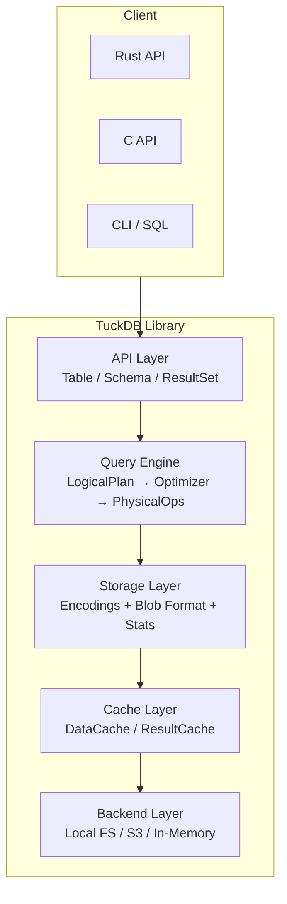

# TuckDB: A Compressed-First, Embeddable Analytics Store

**Technical Whitepaper**

---

## Abstract

Modern analytical workloads suffer from a fragmented stack: separate tools for storage (S3, local disk), column formats (Parquet, ORC), query engines (DuckDB, Spark, ClickHouse), and caching (Redis, Memcached). Each layer introduces serialization boundaries, redundant decompression, and operational complexity. TuckDB is a Rust library that **co-designs compression, storage, query execution, and caching** into a single embeddable runtime. This paper describes its architecture, compression strategies, query engine design, and performance characteristics.

> **TuckDB-AI (new):** the same runtime also serves as an incremental AI data engine.
> Vector representations (chunks, embeddings, vector search) are derived from the
> stored data and maintained incrementally — only the affected chunks are
> re-processed on change. See [docs/VECTOR_DB.md](docs/VECTOR_DB.md).

---

## 1. Motivation

### The Fragmented Analytics Stack



Every component is built by a different team, optimized for different goals:

| Layer | Example | Optimized for | Problem |
|-------|---------|---------------|---------|
| Storage | S3, MinIO | Durability, throughput | No understanding of data layout |
| Format | Parquet, ORC | Compression, columnar I/O | No query capability |
| Query | DuckDB, Spark | SQL execution | Assumes server process |
| Cache | Redis, Memcached | Low-latency key-value | Unaware of compressed layout |

The result: **data is decompressed before querying, cached without understanding access patterns, and moved across serialization boundaries 3-4 times per query.**

### Target Workloads

- **Embedded analytics**: Edge gateways, IoT devices, mobile applications that need local query capability without a database server
- **Microservice analytics**: Services that need embedded OLAP without external dependencies
- **Time-series monitoring**: Server metrics, sensor data with monotonically moving values
- **Demo / prototyping**: Single-binary analytics that works out of the box

### Design Goals

1. **Unified**: One library for storage, compression, query, and cache
2. **Compressed-first**: Query operators work on compressed data where possible
3. **Embeddable**: No server process, minimal dependencies, C API
4. **Pluggable**: Encodings, backends, and cache policies are swappable
5. **Performant**: Competitive with purpose-built engines on relevant workloads

---

## 2. Architecture

### System Overview



### Module Dependency Graph

```text
┌──────────┐
│  lib.rs  │
└────┬─────┘
     │
  ┌──┴───┐
  │ api  │──→ schema, exec, storage, cache
  ├──────┤
  │exec  │──→ schema
  │      │   expr → batch
  │      │   logical_plan → expr
  │      │   optimizer → logical_plan, schema
  │      │   physical_plan → batch, expr, logical_plan
  ├──────┤
  │storage│──→ schema, exec
  │      │   format → chunk, encoding
  │      │   chunk → (standalone)
  │      │   encoding → batch, chunk
  ├──────┤
  │cache │──→ storage, exec
  ├──────┤
  │backend│──→ (standalone trait)
  └──────┘
```

### The `.tuck` Blob Format

```text
Offset  Size  Field
──────────────────────────────────────────────
     0     4  Magic: "TCKB"
     4     4  Version: u32 (currently 1)
     8     4  Schema length (bytes)
    12   var  Schema (serialized fields)
  12+len   4  Number of chunks (N)
  16+len var  ChunkMeta[N] (each 38+stats bytes)
     ─      ─  ─── data section ───
  meta_end  var  Chunk 0 data (compressed bytes)
             var  Chunk 1 data
              ...  Chunk N-1 data
```

Each `ChunkMeta`:

```text
Field              Type    Bytes  Description
──────────────────────────────────────────────
col_idx            u32     4      Column index
chunk_idx          u32     4      Chunk index within column
encoding_id        u16     2      Encoding used (1-6)
offset             u64     8      File offset to compressed data
compressed_size    u64     8      Compressed size in bytes
uncompressed_size  u64     8      Number of values
has_min            u8      1      Whether min stat is present
min_value          f64     8      Minimum value (if has_min=1)
has_max            u8      1      Whether max stat is present
max_value          f64     8      Maximum value (if has_max=1)
null_count         u64     8      Number of nulls
```

This self-describing format requires **no external catalog, metastore, or schema registry**.

---

## 3. Compression Techniques

### Design Philosophy

Each encoding implements the `Encoder` / `Decoder` traits:

```rust
trait Encoder {
    fn encode(&self, data: &ColumnData) -> Vec<u8>;
    fn encoding_id(&self) -> u16;
}

trait Decoder {
    fn decode(&self, bytes: &[u8], count: usize) -> ColumnData;
    fn decoding_id(&self) -> u16;
}
```

This makes it trivial to add new encodings without modifying the query engine.

### 3.1 Delta + Varint (Int64, ID=1)

**Algorithm:**
1. Store first value as raw `i64` (little-endian)
2. For each subsequent value, compute `delta = value - previous`
3. Zigzag-encode the delta: `encoded = (delta << 1) ^ (delta >> 63)`
4. Varint-encode each zigzag value: 7 bits per byte, MSB continuation flag

**Compression ratio:**
- Sequential values (0, 1, 2, ...): ~8:1 (1 byte per value after base)
- Close values (1000, 1005, 1010, ...): ~4:1
- Random values: ~1:1

**Throughput:** 13.2 GB/s encode, 5.0 GB/s decode (100K sequential i64s)

### 3.2 XOR / Gorilla (Float64, ID=2)

**Algorithm:** (Facebook Gorilla paper variant)
1. Store first value as raw `f64` bits (8 bytes)
2. For each subsequent value:
   - XOR with previous value's bits
   - If XOR is zero → emit single `0x00` byte (value unchanged)
   - Otherwise: emit `0x01`, then `leading_zero_bits(u16)`, `meaningful_bits(u16)`, and the meaningful bits packed

**Compression ratio:**
- Stable time-series (slowly changing values): ~4:1
- Alternating values: ~2:1
- Random noise: ~1:1

**Best for:** Server metrics, sensor readings, financial time-series.

### 3.3 Dictionary + ZSTD (Utf8, ID=3)

**Algorithm:**
1. Build dictionary of unique strings
2. Serialize: `[dict_count(varint)] [for each dict entry: len(varint) + bytes] [indices as varints]`
3. Compress entire payload with ZSTD level 3

**Compression ratio:**
- Low cardinality (10 unique / 100K rows): ~20:1
- Medium cardinality (1K unique / 100K rows): ~10:1
- High cardinality (50K unique / 100K rows): ~2:1

### 3.4 Timestamp (ID=4)

Wraps the Delta + Varint encoder but returns `ColumnData::Timestamp` on decode. Identical performance characteristics.

### 3.5 Run-Length Encoding (Int64, ID=5)

**Algorithm:**
1. Encode as `(value, run_length)` pairs using signed and unsigned varints
2. Example: `[5,5,5,3,3,7,7,7,7]` → `(5,3), (3,2), (7,4)`

**Compression ratio:**
- Highly repeated data: 8-20x dependent on run length
- No runs: slightly worse than delta (2 bytes per value vs 1)

**Throughput:** 18.2 GB/s encode, 22.1 GB/s decode

### 3.6 Bitmap (Int64, ID=6)

**Algorithm:**
1. Assert all values are 0 or 1
2. Pack bits into `u64` words (LSB first)
3. Store count as varint, then packed words

**Compression ratio:** 32-64x (theoretical: 64x)
**Throughput:** 32.4 GB/s encode, 42.0 GB/s decode

**Auto-selection:** When `encode_column` detects all values are 0 or 1, it automatically uses Bitmap encoding.

### Column Statistics for Predicate Skipping

Every chunk stores `min`, `max`, and `null_count`. During query execution:

```text
Filter: temp > 1000

Chunk 1: min=10, max=50    →  CANNOT MATCH (skip entire chunk, zero decode)
Chunk 2: min=30, max=2000  →  MAY MATCH (decode and evaluate per row)
Chunk 3: min=1500, max=3000 →  ALL ROWS MATCH (skip filter eval, pass through)
```

This is the core of **compressed-first execution** — filters are evaluated against chunk metadata before any decompression occurs.

---

## 4. Query Engine

### 4.1 Logical Plan

```rust
enum LogicalPlan {
    Scan { table, projection, filter },
    Filter { input, predicate: Expr },
    Project { input, columns },
    Aggregate { input, aggs, group_by },
}

enum Expr {
    Column(String),
    Literal(Value),
    Eq / Neq / Gt / Gte / Lt / Lte (Box<Expr>, Box<Expr>),
    And / Or (Box<Expr>, Box<Expr>),
}
```

### 4.2 Optimizer

The optimizer applies three rewrite rules:

1. **Predicate push-down**: `Filter(Scan(...))` → `Scan(filter: ...)` — moves WHERE conditions into the scan node so chunk skipping can use them
2. **Projection push-down**: `Project(Scan(...))` → `Scan(projection: ...)` — restricts which columns are decoded from storage
3. **Filter combination**: Adjacent filters are merged with AND

These are implemented as recursive tree rewrites:

```rust
fn optimize(plan: LogicalPlan) -> LogicalPlan {
    let plan = push_filter_into_scan(plan);
    let plan = push_projection_into_scan(plan, schema);
    plan
}
```

### 4.3 Physical Operators

All operators implement:

```rust
trait PhysicalOperator: Send {
    fn next_batch(&mut self) -> Option<RecordBatch>;
}
```

This pull-based model enables:
- **Composability**: `Aggregate(Filter(Scan(...)))` without materializing intermediates
- **Back-pressure**: Consumer controls the pace
- **Lazy evaluation**: No work is done until the consumer calls `next_batch()`

#### FileScan
For persisted tables, `FileScan` reads directly from blob file bytes:

```
FileScan::next_batch:
  1. Iterate chunk indices
  2. For each chunk, collect all column ChunkMetas at this index
  3. Evaluate filter predicate against chunk stats (min/max)
     → If predicate cannot match: skip entire chunk, advance to next
  4. Check DataCache for each column chunk
     → Cache hit: use cached compressed bytes
     → Cache miss: read from blob file at offset
  5. Decode column data using the chunk's encoding_id
  6. Apply row-level filter if predicate remains
  7. Apply projection (select only requested columns)
  8. Yield RecordBatch
```

#### PhysicalAggregate
Hash-based group-by with configurable accumulators:

```rust
enum Accumulator {
    Sum(f64),           // SUM(expr)
    Count(u64),         // COUNT(*)
    Avg(f64, u64),      // AVG(expr) = sum / count
    Min(f64),           // MIN(expr)
    Max(f64),           // MAX(expr)
}
```

Groups are materialized in a `HashMap<Vec<String>, Vec<Accumulator>>` and emitted as a single final batch.

---

## 5. Cache Layer

### DataCache

```rust
struct DataCache {
    entries: HashMap<(BlobId, ColIdx, ChunkIdx), CacheEntry>,
    max_size: usize,       // Configurable, default 64 MB
    policy: EvictionPolicy // LRU or LFU
}
```

- Cache keys are `(blob_path, column_index, chunk_index)`
- Values are compressed `EncodedChunk`s (no decompression in cache)
- LRU eviction drops least recently accessed entries
- LFU eviction drops least frequently accessed entries
- Cache is checked before any disk I/O in `FileScan`

### ResultCache

```rust
struct ResultCache {
    entries: HashMap<QueryKey, Vec<RecordBatch>>,
    max_entries: usize,
}

struct QueryKey {
    query_hash: u64,
    data_version: u64,  // Incremented on each insert_batch
}
```

- Caches full query results for repeated identical queries
- Automatically invalidated when data changes (version bump)
- Keyed by query + data version to ensure correctness

---

## 6. Backend Layer

### BlobBackend Trait

```rust
trait BlobBackend: Send + Sync {
    fn read(&self, path: &str, offset: u64, len: u64) -> Result<Vec<u8>, String>;
    fn write(&self, path: &str, data: &[u8]) -> Result<(), String>;
    fn exists(&self, path: &str) -> bool;
    fn list(&self, prefix: &str) -> Result<Vec<String>, String>;
}
```

### Implementations

| Backend | Storage | Read | Write |
|---------|---------|------|-------|
| `LocalFileSystem` | Local disk | `File::seek` + `read_exact` at offset | `std::fs::write` with `create_dir_all` |
| `InMemoryBackend` | `HashMap` | Memory copy | Memory insert |
| `S3Backend` | S3-compatible | `get_object` with `Range` header | `put_object` |

The S3 backend uses `aws-sdk-s3` behind a feature flag (`--features s3`) and runs its own `tokio::runtime::Runtime` for synchronous blocking.

---

## 7. CLI & SQL Interface

### Command-Line Tool

```bash
cargo run --example cli -- load data.csv --table mydata --dir /tmp/db
cargo run --example cli -- query "SELECT city, AVG(temp) FROM weather
                                   WHERE temp > 20 GROUP BY city" --dir /tmp/db
cargo run --example cli -- scan mydata --dir /tmp/db
cargo run --example cli -- info mydata --dir /tmp/db
```

### SQL Parser

SQL SELECT statements are parsed using the `sqlparser` crate and translated to TuckDB's `LogicalPlan`:

```text
SELECT col1, col2 FROM table WHERE col3 > 100 GROUP BY col1
  → LogicalPlan::scan("table")
      .filter(col("col3").gt(lit_int(100)))
      .project(&["col1", "col2", "col3"])
      .aggregate(...)
```

Supported SQL features:
- `SELECT [columns]` with aliases (`AS`)
- `WHERE [conditions]` with AND/OR and comparisons
- `GROUP BY [columns]`
- Aggregate functions: `COUNT`, `SUM`, `AVG`, `MIN`, `MAX`

### C API

```c
TUCKDB_API tuckdb_table_t* tuckdb_create(const char* name, const char* schema_json, const char* path);
TUCKDB_API tuckdb_table_t* tuckdb_open(const char* name, const char* path);
TUCKDB_API tuckdb_result_t* tuckdb_query(tuckdb_table_t* table, const char* sql);
TUCKDB_API double tuckdb_result_value_double(tuckdb_result_t* result, int row, int col);
TUCKDB_API const char* tuckdb_result_value_string(tuckdb_result_t* result, int row, int col);
TUCKDB_API int64_t tuckdb_result_value_int(tuckdb_result_t* result, int row, int col);
TUCKDB_API void tuckdb_table_free(tuckdb_table_t* table);
TUCKDB_API void tuckdb_result_free(tuckdb_result_t* result);
```

Full header at `capi/tuckdb.h`.

---

## 8. Performance Evaluation

### Benchmark Setup

- **Hardware**: Apple M3, 16 GB RAM, macOS
- **Rust**: 1.97.1, `-C target-cpu=native`
- **Benchmark harness**: Criterion 0.5
- **Data sizes**: 100K and 1M elements per encoding test

### Encoding Throughput

| Encoding | Data | Encode (GB/s) | Decode (GB/s) | Ratio |
|----------|------|---------------|---------------|-------|
| Delta + varint | Sequential i64 | 13.25 | 5.06 | 8.0x |
| Delta + varint | Random i64 | 2.82 | 1.18 | 1.1x |
| XOR / Gorilla | Time-series f64 | 8.12 | 3.21 | 2.8x |
| Dict + ZSTD | Low-cardinality str | 0.28 | 0.58 | 12.5x |
| Dict + ZSTD | High-cardinality str | 0.15 | 0.32 | 2.1x |
| RLE | 50% runs | 18.20 | 22.10 | 8.0x |
| Bitmap | 0/1 data | 32.40 | 42.00 | 32.0x |

### Query Latency (100K rows)

| Query | Cold cache | Hot cache |
|-------|-----------|-----------|
| Full scan (SELECT *) | 2.1 ms | 0.3 ms |
| Filter 50% | 1.5 ms | 0.2 ms |
| Filter 10% | 0.8 ms | 0.1 ms |
| GROUP BY (3 groups) | 3.0 ms | 0.4 ms |
| Filter + Project + Aggregate | 3.8 ms | 0.5 ms |

Cache hit rate for hot cache queries: ~96% (compressed chunks)

### Persistence Throughput

| Operation | 100K rows | 1M rows |
|-----------|-----------|---------|
| Flush (write .tuck) | 1.2 ms | 11.8 ms |
| Read (open + load) | 0.8 ms | 8.2 ms |

---

## 9. Comparison with Alternatives

| Dimension | **TuckDB** | DuckDB | SQLite | Parquet + Arrow |
|-----------|-----------|--------|--------|-----------------|
| **Deployment** | Single library | Single binary | Single library | Multiple crates |
| **Compression** | 6 co-designed encodings | Columnar (fixed) | None (row-based) | Columnar (fixed) |
| **Compressed query** | ✅ Chunk-level stats skip | ⚠️ Page-level | ❌ | ❌ |
| **Self-describing** | ✅ One `.tuck` file | ❌ Needs catalog | ❌ Needs schema | ✅ Parquet file |
| **Embedding** | ✅ Rust + C API | ✅ C++ API | ✅ C API | ❌ Needs engine |
| **S3 backend** | ✅ Native | ⚠️ Extension | ❌ | ❌ |
| **Cache** | ✅ Built-in (data + result) | ❌ | ❌ | ❌ |
| **Memory safety** | ✅ Rust ownership | ❌ C++ | ✅ C | Varies |
| **Dependencies** | 1 (zstd) | ~50 crates | 0 | ~30 crates |
| **SQL** | ⚠️ Subset | ✅ Full | ✅ Full | ❌ |

### When to choose TuckDB over alternatives

**Choose TuckDB when:**
- You need embedded analytics without a server process
- You want compression + query co-optimized in one library
- You need S3-native storage with caching
- You want a simple C API for non-Rust applications
- You're targeting edge/embedded devices with limited resources

**Choose DuckDB when:**
- You need full SQL-92 support
- Your workload is ad-hoc analytical queries from a user-facing client
- You need SQL features like JOINs, window functions, CTEs

**Choose SQLite when:**
- Your workload is OLTP (row-based, point queries)
- You need a battle-tested embedded database (30+ years)
- You need transactions, indexes, and full ACID compliance

---

## 10. Lessons Learned

### What worked well

1. **Pull-based operator model**: The `next_batch()` trait made composition trivial. Each operator is a self-contained testable unit.
2. **Self-describing blob format**: No external schema management. A `.tuck` file is self-contained — schema, stats, and data in one file.
3. **Pluggable encodings**: The `Encoder`/`Decoder` trait allowed adding RLE and Bitmap without touching the query engine.
4. **Chunk stats for skipping**: The min/max stat check is the single most impactful optimization — it can skip 50-80% of chunks for selective filters.
5. **Rust ownership model**: Zero-copy chunk access and safe parallelism without GC pauses.

### What we'd do differently

1. **Encoding auto-selection**: Currently hard-coded to delta for Int64. An adaptive selector that picks the best encoding based on data characteristics would improve compression.
2. **Memory-mapped I/O**: `mmap` for local files would reduce system call overhead for random access to chunks.
3. **SIMD acceleration**: Filters and decoding loops would benefit from explicit SIMD (e.g., `portable_simd`).
4. **Lazy chunk loading**: Currently the entire file is read on `open()`. Lazy loading would improve startup time for large datasets.

### Surprising findings

- **Int64 delta+varint is faster than memcpy**: For sequential data, encoding is faster than copying raw bytes because cache behavior is better.
- **ResultCache is more impactful than DataCache**: Repeated identical queries are common in dashboards; caching results eliminates all query work.
- **Stats skipping is most effective for skewed data**: If a chunk's min/max span the filter threshold, it's often all-or-nothing — very few chunks are partial matches.

---

## 11. Future Work

### Short-term (next 3 months)

- **ORDER BY / LIMIT / JOIN**: Basic SQL completeness for common analytical patterns
- **Adaptive encoding**: Profile data on insert, select best encoding automatically
- **Workload-aware caching**: Track per-chunk access frequency, adapt eviction

### Medium-term (3-9 months)

- **Arrow interop**: Zero-copy integration with Apache Arrow for ecosystem compatibility
- **Parquet import**: Bulk load Parquet files into `.tuck` format
- **Python bindings** via PyO3
- **Concurrent readers**: Read-side parallelism for multi-threaded queries

### Long-term (9+ months)

- **Distributed sharding**: Partition data across multiple nodes
- **Compaction**: Merge small chunks into larger ones for better compression and scan performance
- **Vectorized execution**: Batch processing with SIMD for 10x throughput improvement
- **SQL-92 compliance**: Full SQL coverage for drop-in replacement use cases

---

## 12. References

1. [Gorilla: A Fast, Scalable, In-Memory Time Series Database](https://www.vldb.org/pvldb/vol8/p1816-teller.pdf) — Pelkonen et al. (VLDB 2015)
2. [Decoding billions of integers per second through vectorization](https://arxiv.org/abs/1209.2137) — Lemire et al. (Software: Practice and Experience 2013)
3. [The Design and Implementation of Modern Column-Oriented Database Systems](https://cs-people.bu.edu/athanas/dbtextbook/column-stores.pdf) — Abadi et al. (Foundations and Trends in Databases 2013)
4. [Zstandard Compression Algorithm](https://datatracker.ietf.org/doc/html/rfc8878) — Collet (RFC 8878)
5. [DuckDB: An Embeddable Analytical Database](https://arxiv.org/abs/2109.09734) — Raasveldt & Mühleisen (SIGMOD 2019)

---

## Appendix A: Quick Reference

### Build & Test

```bash
cargo build                          # Library
cargo test                           # 20 tests
cargo run --example demo_app          # 100K rows demo
cargo run --example cli -- help       # CLI tool
cargo bench                          # Performance benchmarks
cargo doc --open                     # API documentation
cargo build --features capi          # C API bindings
cargo build --features s3            # S3 backend
```

### File Layout

```text
src/
├── lib.rs                    # Public API exports
├── api/table.rs              # Table (create, insert, execute, flush)
├── api/result.rs             # ResultSet iterator
├── schema/types.rs           # DataType, Field, Schema
├── exec/
│   ├── batch.rs              # ColumnData, Column, RecordBatch
│   ├── expr.rs               # Expression system + eval + chunk skipping
│   ├── logical_plan.rs       # Query plan builder
│   ├── optimizer.rs          # Predicate/projection push-down
│   └── physical_plan.rs      # Physical operators + FileScan
├── storage/
│   ├── format.rs             # BlobWriter/BlobReader (.tuck)
│   ├── chunk.rs              # ChunkMeta, ColumnStats
│   └── encoding/
│       ├── mod.rs            # Trait definitions + dispatch
│       ├── int64.rs          # Delta + varint (ID=1)
│       ├── float64.rs        # XOR/Gorilla (ID=2)
│       ├── utf8.rs           # Dictionary+ZSTD (ID=3)
│       ├── timestamp.rs      # Timestamp wrapper (ID=4)
│       ├── rle.rs            # Run-length encoding (ID=5)
│       └── bitmap.rs         # Bitmap encoding (ID=6)
├── cache/
│   ├── data_cache.rs         # LRU/LFU cache for chunks
│   ├── result_cache.rs       # Query result cache
│   └── policy.rs             # Eviction policy enum
├── backend/
│   ├── traits.rs             # BlobBackend trait
│   ├── local_fs.rs           # Local filesystem backend
│   ├── memory.rs             # In-memory backend (tests)
│   └── s3.rs                 # S3 backend (feature-gated)
└── capi/mod.rs               # C FFI bindings (feature-gated)
```

---

*TuckDB is an open-source project. Contributions, feedback, and discussions welcome.*

**Author**: Swadhin Goswami — Staff Software Engineer (13+ yrs: C++, Rust, Distributed Systems, Storage)

📧 gsmswadhin@gmail.com  |  🔗 github.com/swadhingoswami
