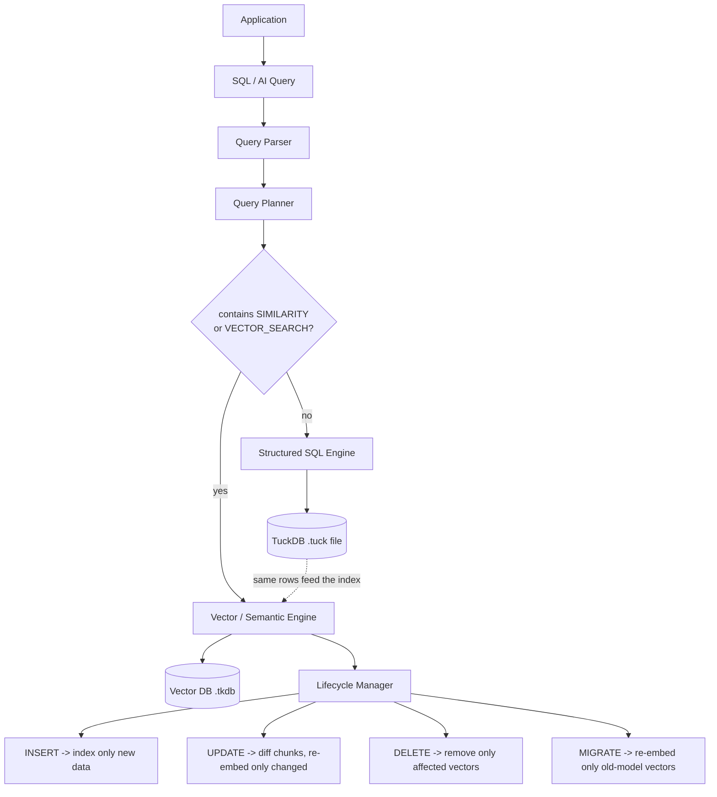
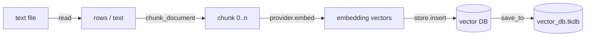
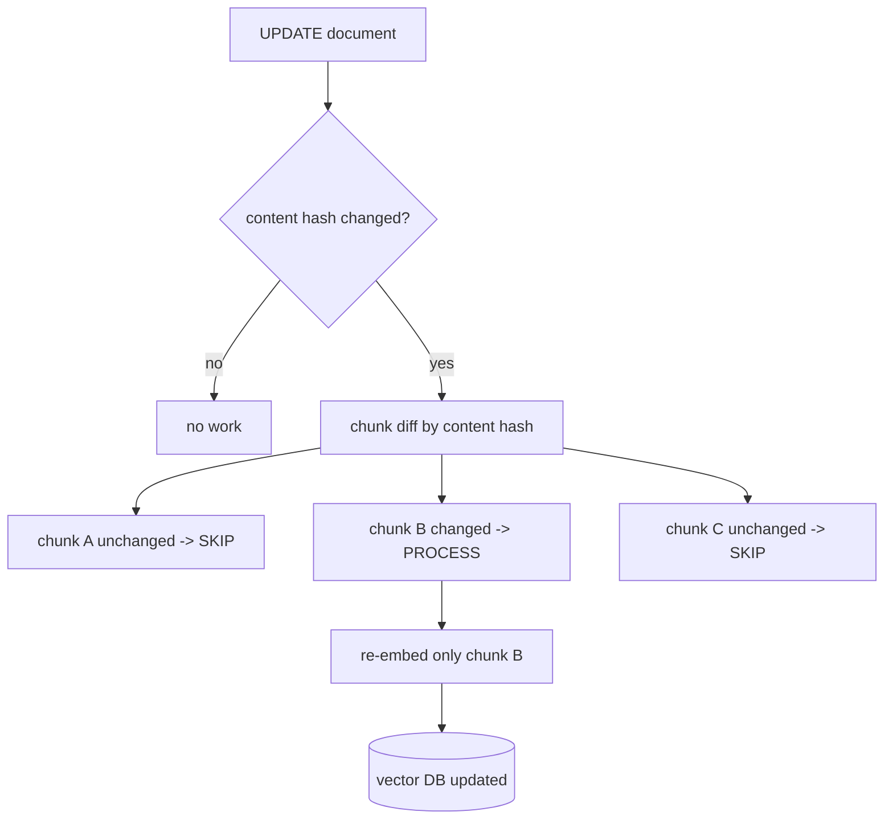
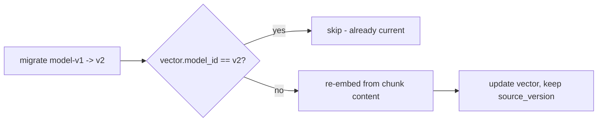
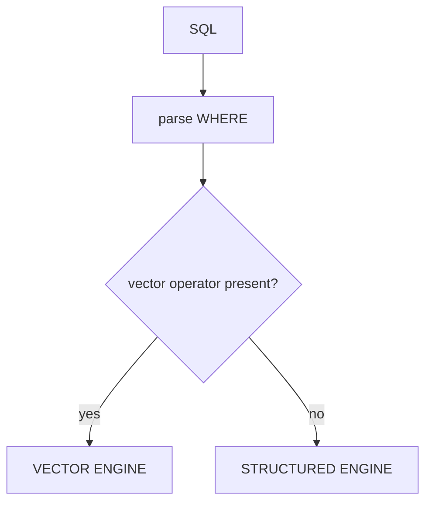

# TuckDB-AI — Incremental AI Data Engine (Vector DB Deep Dive)

> **A small change in AI data can trigger expensive reprocessing of large datasets.**
> TuckDB-AI detects exactly what changed and updates only the affected data.

TuckDB is extended into a **unified SQL + vector engine**. Vector representations
(chunks, embeddings, vector search) are **derived from the same rows stored in the
`.tuck` table** and **maintained incrementally** as that data changes — eliminating
the boundary between the database and its AI representation.

---

## 1. Data model

Every source row becomes a **document**; a document is split into **chunks**; every
chunk is embedded into a **vector**.

```
source row (document id)
   │
   ├── chunk 0  ── content hash ── embedding (vector) ── model id
   ├── chunk 1  ── content hash ── embedding (vector) ── model id
   └── chunk 2  ── content hash ── embedding (vector) ── model id
```

| Component | Where | Key |
|-----------|-------|-----|
| `SourceState` (id, version, content hash, state) | `src/lifecycle/state.rs` | `document_id` |
| `Chunk` (id, source version, hash, content) | `src/lifecycle/chunk.rs` | `(document_id, chunk_id)` |
| `Embedding` (chunk, source version, model, vector) | `src/embedding/store.rs` | `(document_id, chunk_id)` |
| `IncrementalEngine` (orchestrator) | `src/incremental/mod.rs` | — |

**Dependency metadata is the key to incrementality:** the chunk tracker maps every
document directly to its chunks, so update/delete/migration can resolve exactly what
to touch — never a scan of the whole vector set.

---

## 2. Architecture



---

## 3. Flows

### 3.1 Insert (upload a file by path)



Only the **new** file is processed. Existing vectors are untouched.

### 3.2 Query (semantic search)


### 3.3 Update (the core optimization)



### 3.4 Delete

```mermaid
flowchart LR
    DEL[DELETE document] --> C[resolve its chunk ids via chunk tracker]
    C --> V[remove (doc, chunk) vectors by key]
    V --> S[(vector DB)]
```

Cleanup is O(chunks in the document) — no full scan of the vector dataset.

### 3.5 Model migration



Idempotent: re-running migration does zero work.

---

## 4. Query-driven routing

The query itself decides which engine runs (no manual flag):

```sql
-- no SIMILARITY / VECTOR_SEARCH  -> STRUCTURED ENGINE  (reads the .tuck file)
SELECT id, question FROM cpp_questions WHERE topic = 'cpp';

-- contains SIMILARITY            -> VECTOR ENGINE      (searches the vector DB)
SELECT id FROM cpp_questions
WHERE SIMILARITY(answer, 'How does C++ transfer ownership?') > 0.4;

-- contains VECTOR_SEARCH         -> VECTOR ENGINE      (explicit 3-arg clause)
SELECT id FROM cpp_questions
WHERE VECTOR_SEARCH(answer, 'How does C++ transfer ownership?', 0.4) LIMIT 3;
```



---

## 5. Persistence

| File | Contains | Format |
|------|----------|--------|
| `*.tuck` | compressed columnar table (schema + chunk metadata + encodings) | `TKCB` magic |
| `*.tvec` | vector store only (embeddings) | `TKVB` magic |
| `*.tkdb` | **whole engine state**: lifecycle + chunks + vectors + model id | `TKIE` magic |
| `manifest.txt` | demo doc id ↔ file path mapping | text |

`IncrementalEngine::save_to / load_from` round-trips everything, so a restart
restores the DB **without re-processing anything**; subsequent `add`/`del` touch
only the affected file.

---

## 6. Benchmark snapshot

`cargo run --release --example benchmark_report` → `target/benchmark_report.md`.
Mock model-v1 (128 dims), 5 chunks per document. Naive baseline = re-embed every chunk once.

| scale | chunks | changed | regenerated | work avoided | speedup vs naive |
|-------|--------|---------|-------------|--------------|------------------|
| 1,000 | 5,000 | 1% | 50 | 99.0% | 73.0x |
| 10,000 | 50,000 | 1% | 500 | 99.0% | 74.1x |
| 100,000 | 500,000 | 1% | 5,000 | **99.0%** | **72.7x** |
| 100,000 | 500,000 | 5% | 25,000 | 95.0% | 18.2x |
| 100,000 | 500,000 | 10% | 50,000 | 90.0% | 14.6x |
| 100,000 | 500,000 | 100% | 500,000 | 0.0% | 1.3x |

Headline case: **500,000 chunks, 1,000 changed → 1,000 processed, 499,000 skipped
→ 99.8% work avoided** (`examples/incremental_demo`).

---

## 7. API overview

```rust
use std::sync::Arc;
use tuckdb::{EmbeddingProvider, MockEmbeddingProvider, IncrementalEngine};

let mut engine = IncrementalEngine::new(Arc::new(MockEmbeddingProvider::default()));

engine.ingest(1, "…document text…");                       // chunk + embed + store
let r = engine.update(1, "…changed text…")?;               // only changed chunks
let d = engine.delete(1)?;                                 // only that document
engine.migrate_model(Arc::new(MockEmbeddingProvider::new("model-v2", 128)));

let qv = MockEmbeddingProvider::default().embed("…question…");
let top = engine.store().search(&qv, 5);                   // top-K cosine results
engine.save_to(std::path::Path::new("vector_db.tkdb"))?;   // persist everything
```

Other public pieces: `LifecycleManager`, `ChunkTracker`, `ContentDedup`,
`SemanticDedup`, `EmbeddingStore`, `Expr::Similarity`, `LogicalPlan::Limit`.

---

## 8. Run it

```bash
cargo test                                  # correctness
cargo run --release --example showcase      # full live demo
cargo run --release --example benchmark_report
cargo run --example file_index_demo -- --file data/demo_cpp.txt
cargo run --example unified_demo -- --csv data/cpp_questions.csv
./scripts/e2e_demo.sh                       # full end-to-end demo with real output
```

Sample data lives in `data/`. Point the demos at your own `.txt`, `.md`, `.pdb`, or `.csv`.

See [E2E_DEMO.md](E2E_DEMO.md) for a complete, unedited end-to-end transcript.
